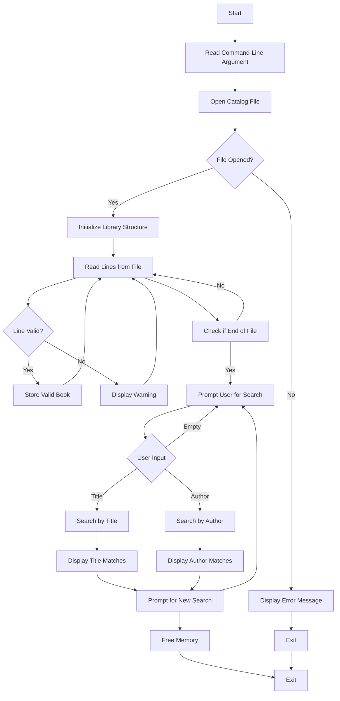

# Flowchart for Library Program Workflow

This flowchart outlines the main workflow of the library program, detailing the steps from reading the catalog file to processing user searches and exiting the program. Each decision point and action is represented to provide a clear understanding of how the program operates.